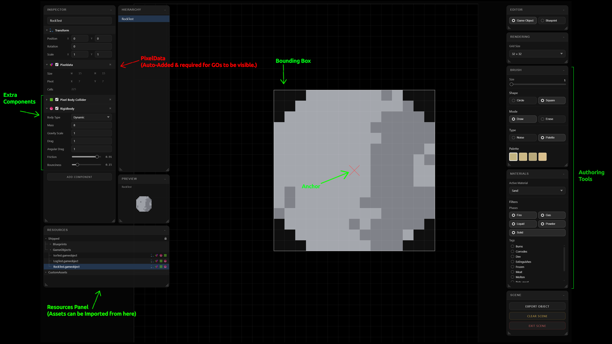

# SaltPeter — Editor Guide <!-- omit in toc -->

This guide covers everything you need to create game objects in the SaltPeter editor and test them in the sandbox. No programming required.

---

## Table of Contents <!-- omit in toc -->

- [Getting Started](#getting-started)
- [Keyboard Shortcuts](#keyboard-shortcuts)
- [Painting](#painting)
- [Editor Modes](#editor-modes)
  - [GameObject Mode](#gameobject-mode)
  - [Blueprint Mode](#blueprint-mode)
- [The Editor Interface](#the-editor-interface)
  - [Rendering Panel](#rendering-panel)
  - [Materials Panel](#materials-panel)
  - [Brush Panel](#brush-panel)
  - [Scene Panel](#scene-panel)
  - [Hierarchy Panel](#hierarchy-panel)
  - [Inspector Panel](#inspector-panel)
  - [Resources Panel](#resources-panel)
  - [Resources Preview Panel](#resources-preview-panel)
- [Importing an Existing Object](#importing-an-existing-object)
- [Exporting a Game Object](#exporting-a-game-object)
- [Components](#components)
  - [Transform](#transform)
  - [PixelData](#pixeldata)
  - [Rigidbody](#rigidbody)
  - [Pixel Body Collider](#pixel-body-collider)
  - [Box Collider](#box-collider)
  - [Circle Collider](#circle-collider)
- [Sandbox Scene](#sandbox-scene)
- [Authoring Tips](#authoring-tips)

---

## Getting Started

Download the latest version from the releases page, install the game and open it from the chosen install location. Once the app is running you will be in the scene select menu. Authoring happens in the **Editor Scene**, testing happens in the [**Sandbox Scene**](#the-sandbox).

The editor has two modes switchable from the toolbar: **GameObject** and **Blueprint**. To create objects that will simulate in the world, use the [**GameObject**](#gameobject-mode) mode. [**Blueprints**](#blueprint-mode) are wang tiles used for world generation.

---

## Keyboard Shortcuts

| Key | Action |
|-----|--------|
| `Mouse Wheel` | Decrease / Increase brush size |
| `Shift` | Enables bounding box selection |
| `Alt` | Enables eyedropper mode *(click a pixel to sample it)* |
| `Ctrl` | Enables anchor placement |

---

## Painting

Left-click and drag to paint on the canvas. Switch to [erase mode](#brush-panel) to do the same thing in reverse.

Pixels are placed at 1:1 scale — *one pixel in the editor equals one simulation cell in the world*. There is no scaling at paint time. Size your art at the scale you want it to appear in game.

**Air (material ID 0)** is the empty/transparent material. Cells painted with air are invisible. The game object grid includes all cells within the bounding rectangle; cells left as air are transparent gaps in the shape.

---

## Editor Modes

### GameObject Mode

This is where you author interactive objects — a rock, a log, a barrel. Each game object is a named collection of pixel cells painted with specific materials. When placed in the world, the pixels simulate physically: they fall, burn, melt, dissolve, and react with the environment.

All **GameObjects** require a [PixelData](#pixeldata) component, and it is added automatically when you boot into the scene. Read the [**Components**](#components) section to understand that system better.

### Blueprint Mode

Blueprints are construction guide overlays. They define where pieces should go during a build sequence. They have no material physics — they are visual placement templates only. Unless you are authoring construction guides, stay in [GameObject mode](#gameobject-mode).

---

## The Editor Interface


### Rendering Panel
The **Rendering Panel** allows you to set the canvas grid size — this is your zoom level for working. Each grid cell always represents exactly one pixel in the world; zooming in does not make your art larger, it just makes it easier to paint precise detail.

### Materials Panel
The **Materials Panel** is your material library. It contains all registered materials organized by phase. Use the filter buttons at the top to narrow to a specific phase group:

- **Solid** — stone, metals, wood, ice, etc.
- **Powder** — sand, dirt, ash, gunpowder, snow, etc.
- **Liquid** — water, lava, oil, acid, blood, honey, etc.
- **Gas** — air, smoke, steam, flammable gas, poison gas
- **Fire** — fire (one material)

It is highly recommended to just stick to **Solid** and **Powder** when authoring. Remember, this is a group of pixels that move together, liquids and gases or fire normally don't — but hey, you're the author, do what you want!

*All cells of a GameObject are simulated as a single body until released under certain conditions like phase transitions or reactions.*

**Click a material in the list to select it. That material becomes active on your brush.**

**Variant Picker** — Some materials have named color variants (e.g. Cloth has: red, blue, green, yellow, black). When a material has variants, a color swatch row appears below the material list. Click a swatch to select which variant your brush will paint.

### Brush Panel
The **Brush Panel** controls how paint is applied to the canvas.

| Control | What It Does |
|---------|-------------|
| **Size** | Brush radius in pixels. |
| **Shape** | Circle or Square. Changes the footprint of the brush. |
| **Mode** | Draw or Erase. Erase removes pixels *(replaces with air)*. |
| **Type** | Noise or Palette. See below. |

**Type: Noise** — Adds a procedural texture pattern to the stroke using randomness and blob/grain.

**Type: Palette** — Paints using the exact color variants defined on the material. Each pixel in the stroke will use the exact palette color chosen.

### Scene Panel

This panel allows you to export your object, clear the scene, or exit.

Exporting is only allowed once you have given your GameObject a name, created the bounding box, and placed the anchor. Please see [Exporting a Game Object](#exporting-a-game-object) for more details on the specific flow.

### Hierarchy Panel

The **Hierarchy** panel shows all objects currently loaded in the editor session. You can:

- Click an object to select it and load its pixel data onto the canvas
- Rename objects
- Add a new empty object
- Delete objects

When you export, the currently selected object in the hierarchy is what gets saved.

### Inspector Panel

The **Inspector** shows information about the currently selected GameObject in the [Hierarchy](#hierarchy-panel). It holds the list of components on the GameObject. Use the [Pixel Body Collider](#pixel-body-collider) component to add collisions and the [Rigidbody](#rigidbody) component to add physics.

### Resources Panel

Your **Resources** are in the Resources Panel. Assets that you export will appear in *CustomAssets* and can be re-imported into the editor from there, or drag and drop to add them to the [sandbox scene](#the-sandbox).

### Resources Preview Panel

The Preview Panel shows a preview of the selected resource's [PixelData](#pixeldata) component.

---

## Importing an Existing Object

Right click an asset in the [Resources Panel](#resources-panel) to load an existing `.gameobject.json` file back into the editor. The object's pixels are rendered on the canvas and you can continue editing.

Shipped assets are in:
```
src/game/resources/GameObjects/
```

*Load any of these to see a working example before you start from scratch.*

Your exported assets are in:
```
Documents/SaltPeter/CustomAssets/
```

---

## Exporting a Game Object
When you are satisfied with your art:

1. Make sure the correct object is selected in the [Hierarchy](#hierarchy-panel) and it has a name
2. Add a bounding box to select the pixels that will be included
   1. `Shift+Click` to enter bounding box placement mode, drag around the desired area, and let go.
3. Add an anchor. This is the [pivot point](#pixeldata) of the object.
   1. `Ctrl+Click` to place an anchor within the bounding box.
4. Click **Export** in the [Scene Panel](#scene-panel)
5. A `.gameobject.json` and a `.gameobject.meta` file are written to `Documents/SaltPeter/CustomAssets/GameObjects/`

The meta file contains a GUID that the game uses to reference this object by identity. Do not rename or delete the meta file separately from the JSON — they are a pair.

---

## Components

Components are attached to a GameObject to define its appearance and physics. Each component is added through the editor's [Inspector Panel](#inspector-panel).

### Transform


Every GameObject has a Transform. It defines the object's position, rotation, and scale in world space. You do not add this manually — it is always present. You will rarely need to touch it directly; the engine handles position when you place an object.

### PixelData


The visual and material content of the object. Every cell you paint in the editor is stored here — each cell records its position in the grid, which material it is, and which color variant is used. The PixelData component is added automatically when you enter [GameObject mode](#gameobject-mode) and is the primary thing you are authoring.

**Pivot** — The local origin point of the object, set in pixel coordinates. When the object is placed or rotated in the world, it pivots around this point. Defaults to the center of the bounding box. This is the anchor that you add when [exporting the object](#exporting-a-game-object).

### Rigidbody


Gives the object physical mass so it can move, fall, and collide. Without a Rigidbody, the object is placed as a static decoration that does not move.

| Field | What It Does |
|-------|-------------|
| **Body Type** | `Dynamic` — affected by gravity and forces. `Static` — never moves, immovable wall/floor. `Kinematic` — moved by code only, not physics. |
| **Mass** | How heavy the object is. Heavier objects are harder to push and fall faster under gravity. |
| **Gravity Scale** | Multiplier on gravity. 1.0 = normal. 0 = floats. Negative = rises. |
| **Drag** | Linear air resistance. Higher values slow the object down as it moves. |
| **Angular Drag** | Rotational air resistance. Higher values stop it from spinning freely. |
| **Friction** | Surface friction when sliding against other objects. 0 = frictionless, 1 = high grip. |
| **Bounciness** | How elastic collisions are. 0 = no bounce, 1 = perfect bounce. |

### Pixel Body Collider


Generates a collision shape that matches the exact pixel silhouette of the object's [PixelData](#pixeldata). The shape is computed automatically around the non-air pixels. This is the correct collider for most objects — use it whenever you want the object to collide with the world using its actual painted shape.

The collider rebuilds itself whenever the PixelData changes. You do not need to configure it manually.

### Box Collider


A simple rectangular collision shape. Faster than the [Pixel Body Collider](#pixel-body-collider). Use this when the object is roughly rectangular and you do not need pixel-perfect collision, or as a secondary trigger zone.

**Size** — Width and height of the box in pixels.

### Circle Collider


A circular collision shape. Use for round objects like cannonballs where a circle fits the shape well and you want efficient, smooth collision response.

**Radius** — Radius of the circle in pixels.

---

## Sandbox Scene
The **Sandbox** is a separate scene where you can place your game objects into a live pixel simulation and watch them interact with the world.

Switch to the sandbox from the scene selector in the top navigation bar.

In the sandbox:
- You can place any exported game object by dragging it from the [Resources Panel](#resources-panel) and dropping it into the scene
- The simulation runs at full speed — objects fall, burn, melt, and react in real time
- You can also paint materials directly onto the world using the same [brush tools](#brush-panel) as the editor
- Use the **Simulation Panel** to pause, or change simulation speed

To test destructive interactions, paint fire, acid, lava, or water onto or near your object after placing it.

---

## Authoring Tips
**Start with solids for rigid objects.** Stone or wood are great starting materials.

**The [pivot point](#pixeldata) matters.** When the object is placed in the world, it is placed by its pivot. The pivot defaults to the center of the bounding box. If your object has an unusual center of mass, it might behave oddly.
