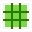
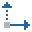

<!-- HIERARCHY_START -->
[Nitrate](../README.md) / Component
<!-- HIERARCHY_END -->

# Component
Modular data attached to game objects.

Each component definition carries a typed payload (transform, rigidbody, collider, pixel data, blueprint) that the engine reads during simulation and export. The registry auto-discovers all definitions at startup.

<!-- ICONS_START -->
       
<!-- ICONS_END -->

<!-- API_START -->
---

## API

### [`BlueprintLayout`](BlueprintLayout.ts)
Computes pixel-space geometry for a blueprint tile's margin strip and the six seam edge zones.
Orientation (landscape H vs portrait V) is inferred from the tile dimensions passed to [`GetEdgeZones`](BlueprintLayout.ts).

| Interfaces & Types |
|--------------------|
```ts
type EdgeKey = 'N_L' | 'N_R' | 'S_L' | 'S_R' | 'W' | 'E' | 'W_T' | 'W_B' | 'E_T' | 'E_B' | 'N' | 'S';
```

```ts
interface EdgeZone { bounds: Rect2D; key: EdgeKey }
```

| Method | Description |
|--------|-------------|
| [`static GetMarginSize(): number`](BlueprintLayout.ts) | Returns the width of the outer margin strip in cells. |
| [`static GetEdgeSize(): Size2D`](BlueprintLayout.ts) | Returns the pixel dimensions of a single edge zone rectangle. |
| [`static GetEdgeZones(width: number, height: number): EdgeZone[]`](BlueprintLayout.ts) | Returns the six edge zones for a tile of the given pixel dimensions. Each zone carries its `EdgeKey` and tile-local pixel bounds. |

---

### [`BlueprintQuery`](BlueprintQuery.ts)
 Helpers for reading and comparing blueprint edge seams.


---

### [`ColliderGenerator`](ColliderGenerator.ts)
 Generates colliders for GameObjects.


---

### [`Component`](Component.ts)
 Shared base for all component types.

| Interfaces & Types |
|--------------------|
```ts
type ComponentType =
    | 'Blueprint'
    | 'BoxCollider'
    | 'CircleCollider'
    | 'ParticleSystem'
    | 'PixelData'
    | 'PixelBodyCollider'
    | 'Rigidbody'
    | 'Transform'
```


---

### [`ComponentRegistry`](ComponentRegistry.ts)
 Auto-discovers and registers all component definitions from the definitions directory.


---

### [`PixelDataRenderer`](PixelDataRenderer.ts)
Renders a flat array of `PixelCell` data onto a 2D canvas using material color lookups.


---

<!-- API_END -->